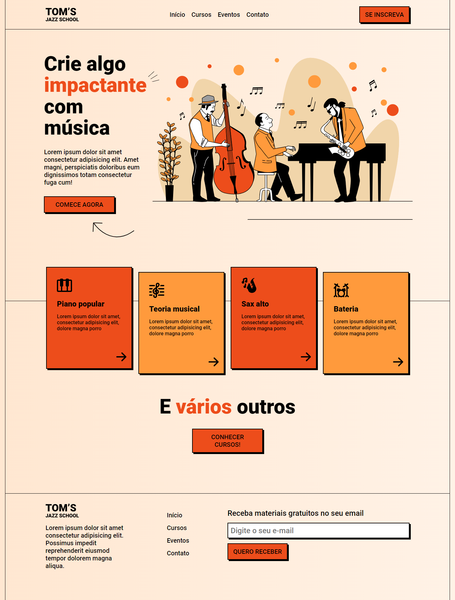
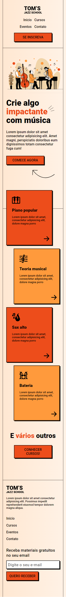

<h1>Tom's Jazz School🎷</h1>

<h2>Sobre o Projeto</h2>
Este projeto tem como objetivo aprimorar minhas habilidades com CSS, especialmente na implementação da abordagem "mobile-first", sendo a minha primeira experiência com essa técnica. Este projeto foi desenvolvido pela OneBitCode com algumas alterações minhas.

<h2>Modelo Desktop</h2>

<h2>Modelo Mobile</h2>

